# 원티드 프리온보딩 백엔드 인턴십 과제
## 지원자명: 김나현

# 🗂️ 목차
<small> 목차 클릭 시 해당 목차로 이동합니다.</small>

### [1. 기술 스택](#-1-기술-스택)
### [2. Database ERD](#-2-database-erd)
### [3. 애플리케이션 실행방법 & 환경변수](#-3-애플리케이션-실행방법--환경변수)
### [4. API 명세서](#-4-API-description)
  - [4-1. 회원 API - 2개](#-4-1-member-회원)
  - [4-2. 게시글 API - 5개](#-4-2-post-게시글)
### [5. API 시현 영상](#-5-API-시현-영상)
### [6. 구현 방법 및 이유에 대한 간략한 설명](#-6-구현-방법-및-이유에-대한-간략한-설명)

---

# 🏷 1. 기술 스택


[](https://localhost:8080/swagger-ui/index.html)

---
# 🏷 2. Database ERD
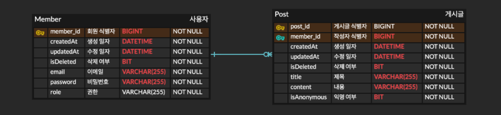

---
# 🏷 3. 애플리케이션 실행방법 & 환경변수

1. MySQL 데이터베이스를 생성 후(예시: board) 권한 설정(root 혹은 다른 user 권한)을 합니다. 
2. IDE 에서 아래를 참고하여 환경변수 설정을 합니다. 
3. Spring 서버를 기동합니다.
4. 로컬 swagger 링크에 접속 후, API를 테스트 하실 수 있습니다. 
   - http://localhost:8080/swagger-ui/index.html 

```
${DB_HOST}: 데이터베이스 호스트 주소 입니다. (default: localhost)
${DB_NAME}: 데이터베이스 이름 입니다. (default: board)
${DB_PORT}: 데이터베이스 포트 번호 입니다. (default: 3306)
${DB_USERNAME}: 데이터베이스 사용자명 입니다. (default: root or board)
${DB_PASSWORD}: 데이터베이스 비밀번호 입니다. (default: 로컬 사용자의 db username의 비밀번호)
${JWT_SECRET_KEY}: JWT 토큰 생성시 사용하는 비밀 키 입니다. (default: tmppassword)
```

IntelliJ IDE - Environment Variables 에 입력 시 사용합니다.<br>

```DB_HOST=localhostDB_NAME=board;DB_PORT=3306;DB_USERNAME=root;DB_PASSWORD=db비밀번호입력;JWT_SECRET_KEY=tmppassword```

---
# 🏷 4. API description
## 👥 4-1. Member (회원)
### a. 회원가입
### `request`


### `response`
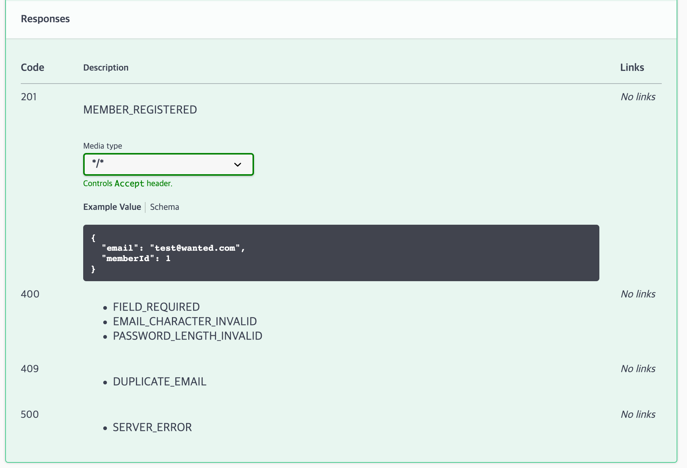

---
### b. 로그인
### `request`
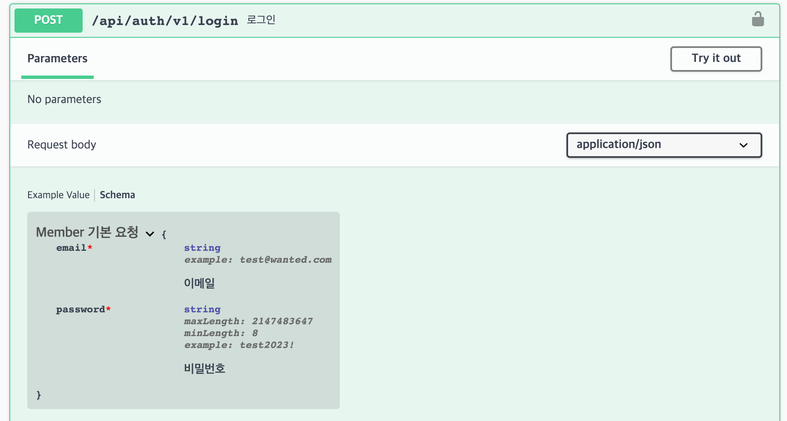

### `response`
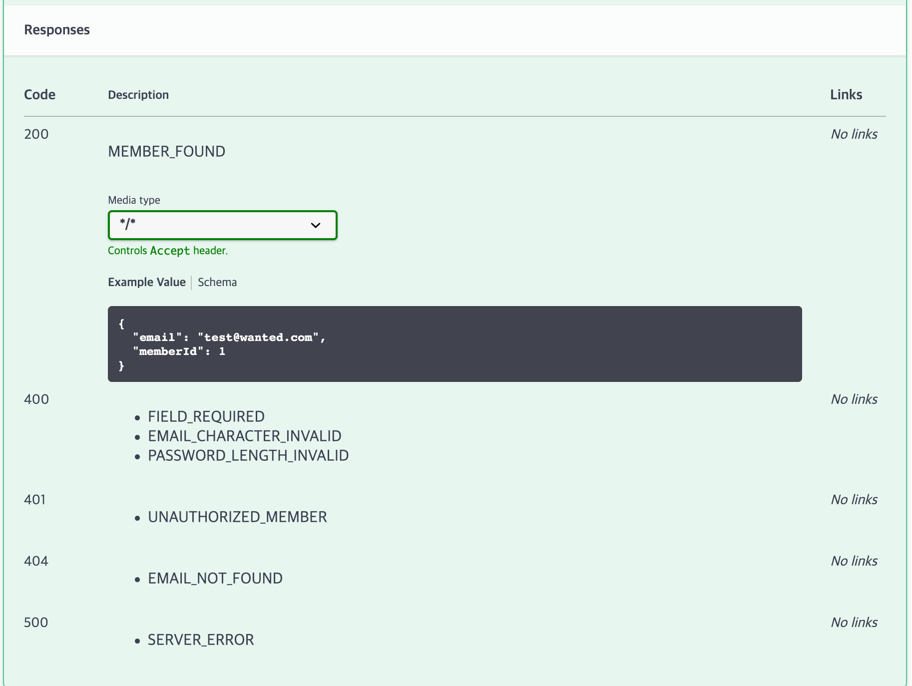

---
## 📝 4-2. Post (게시글)
### a. 게시글 저장
### `request`
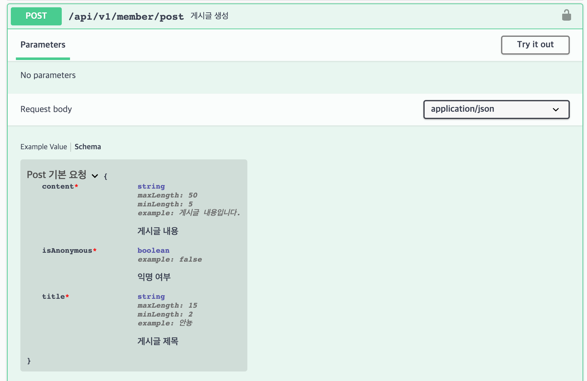

### `response`
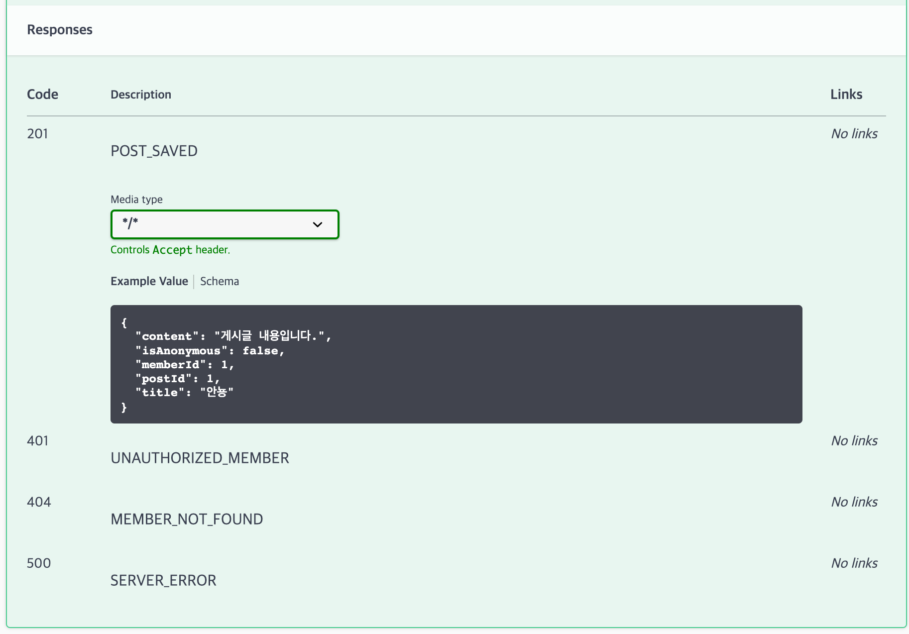

---
### b. 게시글 수정
### `request`
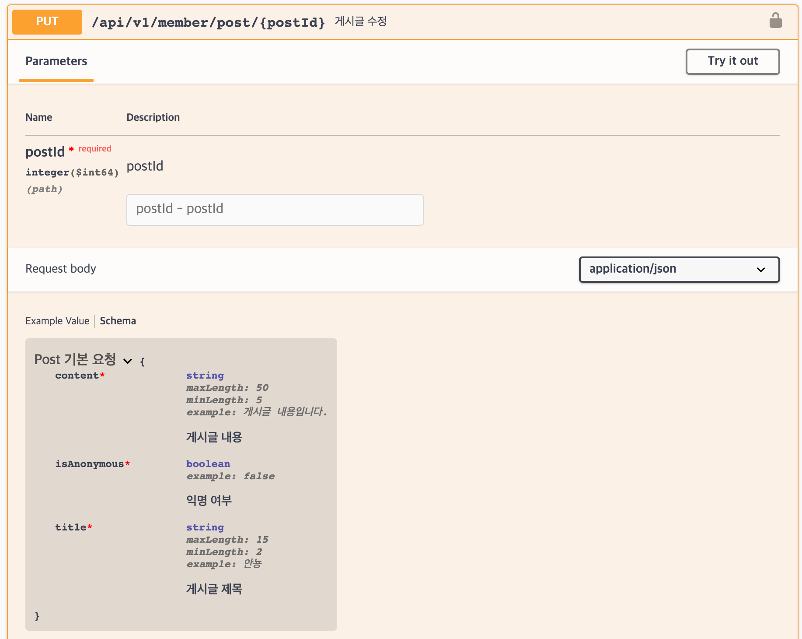

### `response`
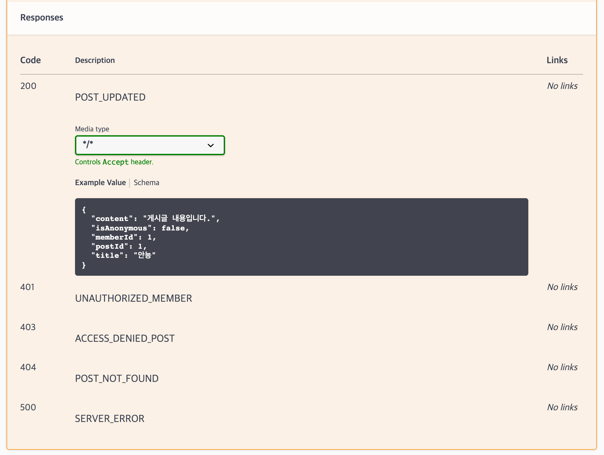

---
### c. 게시글 삭제
### `request`
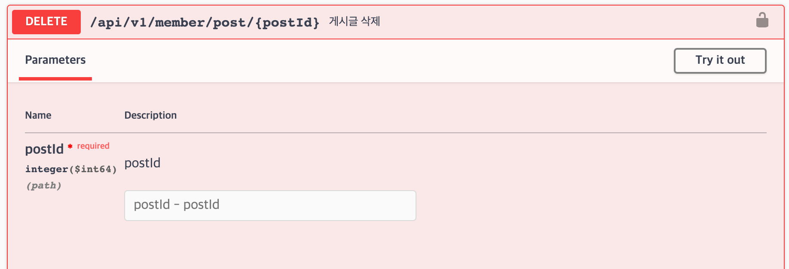

### `response`
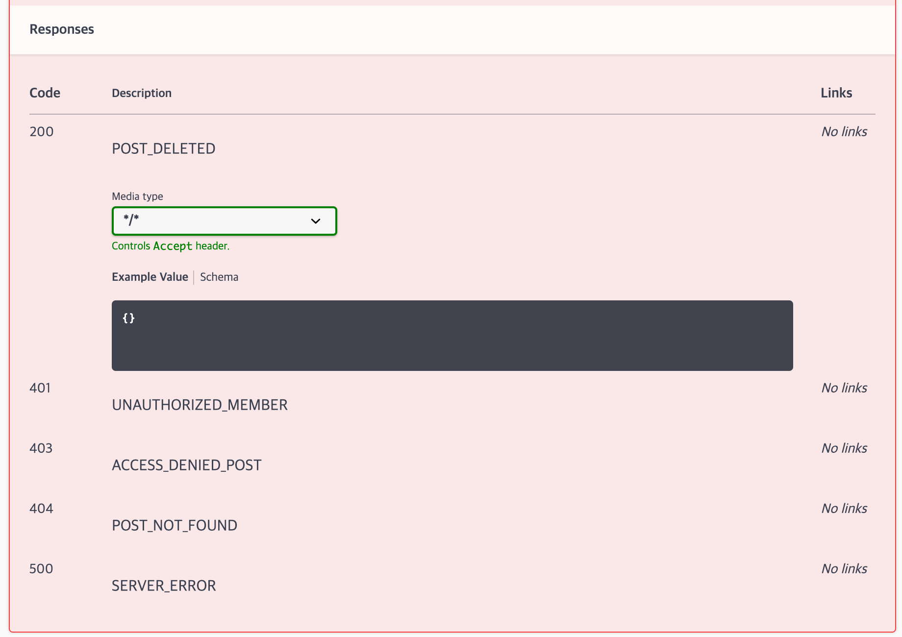

---
### d. 게시글 단건 조회
### `request`
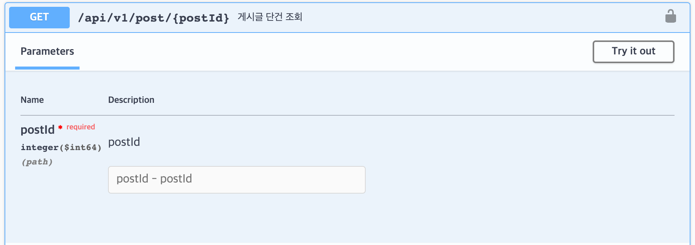

### `response`
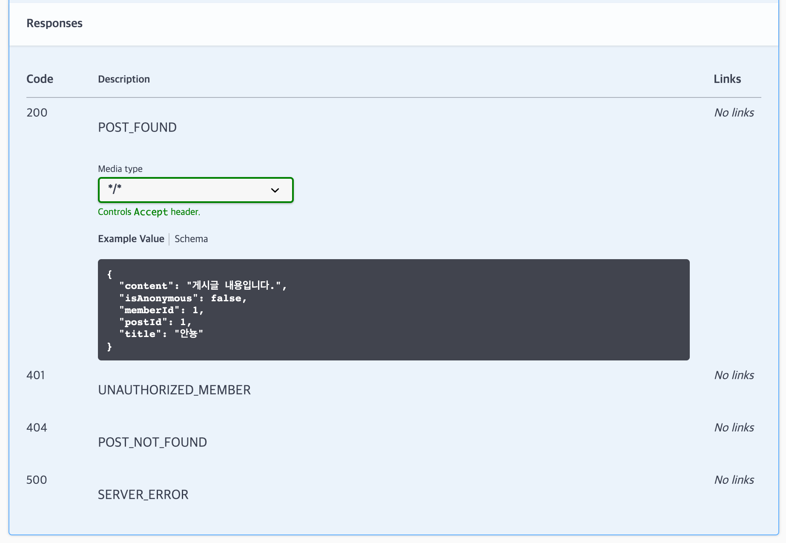

---
### e. 게시글 다건 조회
### `request`
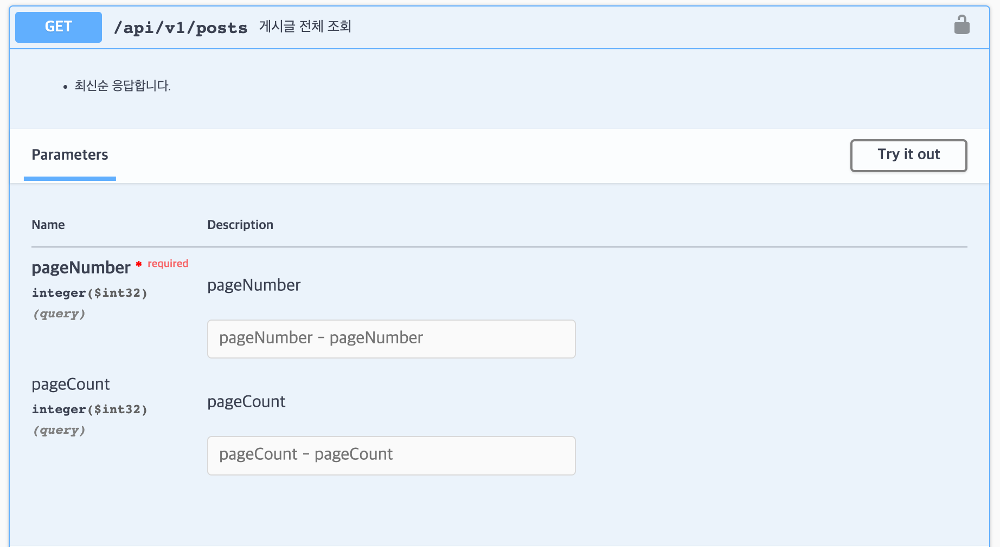

### `response`
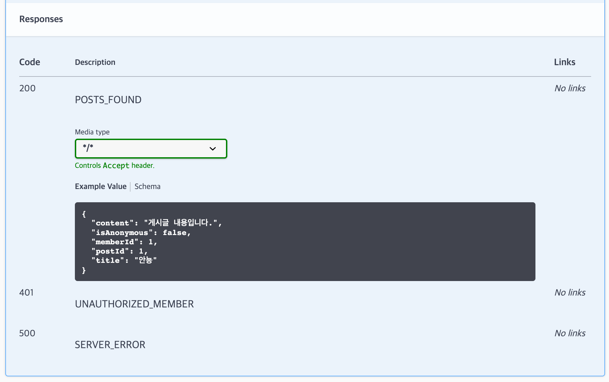

---
# 🏷️ 5. API 시현 영상

### https://youtu.be/fHNeYT75fH8

---

# 🏷 6. 구현 방법 및 이유에 대한 간략한 설명

## 6-1. 인증 및 인가 설정
- Spring Security가 제공하는 API 들을 사용하여 인증, 인가 설정을 관리합니다. 
- URI 를 통해 인증 작업을 합니다. 
- 권한은 익명사용자 혹은 ROLE_USER 로만 구성되므로, 권한 계층 설정과 같은 추가적인 구현은 하지 않았습니다.
- [관련 파일]
  - [SecurityConfig -시큐리티 API 설정파일](src/main/java/wanted/preonboarding/boardspring/auth/SecurityConfig.java)  
  - [CustomJwtAuthenticationFilter -JWT 인증 필터](src/main/java/wanted/preonboarding/boardspring/auth/CustomJwtAuthenticationFilter.java)
  - [UserDetailsService -유저 정보 조회 서비스](src/main/java/wanted/preonboarding/boardspring/auth/CustomUserDetailsService.java)
  - [JwtProvider -JWT 관리 Util](src/main/java/wanted/preonboarding/boardspring/auth/JwtProvider.java)
  - [CustomAuthenticationEntryPointHandler -JWT 인증 예외 핸들러](src/main/java/wanted/preonboarding/boardspring/exception/CustomAccessDeniedHandler.java)
  - [CustomAccessDeniedHandler -JWT 인가 예외 핸들러](src/main/java/wanted/preonboarding/boardspring/exception/CustomAccessDeniedHandler.java)

## 6-2. 예외 처리
- 커스텀한 예외처리 방식으로 구체적이되 정형화된 예외 코드로 응답할 수 있습니다.
  - [ExceptionCode](src/main/java/wanted/preonboarding/boardspring/exception/ExceptionCode.java)
  - [CustomException](src/main/java/wanted/preonboarding/boardspring/exception/CustomException.java)
  - [CustomExceptionHandler](src/main/java/wanted/preonboarding/boardspring/exception/CustomExceptionHandler.java)
  - [DefaultExceptionResponseDto](src/main/java/wanted/preonboarding/boardspring/exception/DefaultExceptionResponseDto.java)

## 6-3. 회원 API
- 회원가입
  - Bean Validation 으로 [MemberDefaultRequestDto](src/main/java/wanted/preonboarding/boardspring/domain/dto/MemberDefaultRequestDto.java) 에서 형식과 길이 와 같은 검증을 진행합니다.
  - [이메일 가입 여부 확인과 같은 비지니스 로직 검증](src/main/java/wanted/preonboarding/boardspring/service/MemberService.java)은 서비스 내 validateEmailExistence() 메서드에서 처리합니다.
  - 회원 생성 및 저장 후  [MemberDefaultReqesponseDto](src/main/java/wanted/preonboarding/boardspring/domain/dto/MemberDefaultReqesponseDto.java)로 반환합니다.
- 로그인
  - 회원가입과 같이 같은 dto와 같은 서비스 내 메서드를 사용하여 검증합니다.
  - 로그인 성공 시 jwt 토큰 발급 후 헤더에 담아서 회원 정보 dto 와 함께 반환합니다.
  - 회원 탈퇴로 인해 더이상 토큰이 유효하지 않으면 CustomUserDetailsService에서 UsernameNotFoundException을 throw 하게 되는데, 이를 CustomJwtAuthenticationFilter 인증 필터에서 catch 하여 함께 처리합니다.

## 6-4. 게시글 API
- ### 게시글 생성 / 수정 / 삭제
  - /member URI 로 인해 Security 에서 인증 처리를 합니다.
  - 수정과 삭제의 경우 작성자만 접근할 수 있으므로, PostService 에서 validatePostAuthorization() 메서드를 통해 추가 검증을 합니다.
  - 생성과 수정은 성공 응답 시 PostDefaultResponseDto 데이터와 함께 응답합니다. 
  - 삭제는 데이터 필드 없이 반환합니다.
- ### 게시글 전체 조회 / 단건 조회
  - /member URI 가 포함되지 않으므로 익명 사용자도 접근 가능합니다.
  - 전체 조회의 경우 조회되는 게시글이 없으면 빈 배열로 반환합니다.
  - 전체 조회의 경우 페이징을 적용하였습니다.
    - parameter 2개(`pageNumber`-required, `pageCount`-non required)를 받습니다.
    - pageNumber 는 `요청할 페이지 넘버`를 의미합니다. 0번부터 시작합니다.
    - pageCount 는 `응답할 게시글의 개수`를 의미합니다. (defualt: 10개)
    - 최신순으로 정렬하여 응답합니다.
  - 게시글 및 회원 전부 BaseEntity 에 isDeleted 필드를 통해 soft delete 되도록 처리했습니다. 회원 탈퇴 엔드포인트를 개발 시 해당 요청 시에만 hard delete 되도록 처리할 예정입니다.
